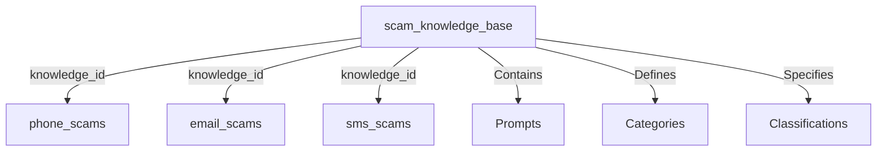

# MongoDB Database Schema Documentation

## Overview

The scam detection system uses MongoDB with two primary database purposes:
1. **Knowledge Base**: Stores scam type definitions, categories, and prompts
2. **Synthetic Data Storage**: Stores generated synthetic scam/legitimate data

## Database Structure

### Database: `scam_detection`

The system uses a single database named `scam_detection` containing multiple collections:

```
scam_detection/
├── scam_knowledge_base/        # Knowledge base for prompts and definitions
├── phone_scams/               # Generated phone transcript data
├── email_scams/               # Generated email phishing data
└── sms_scams/                 # Generated SMS scam data
```

## Collection Schemas

### 1. Knowledge Base Collection: `scam_knowledge_base`

Stores all scam type definitions, categories, and their associated prompts.

#### Schema Structure:
```javascript
{
  "id": "phone_transcript.tech_support_scam",  // Unique ID: {type}.{category}
  "type": "phone_transcript",                  // Scam type identifier
  "category": "tech_support_scam",            // Category within the type
  "name": "Tech Support Scam",                // Human-readable name
  "description": "Technical support scams...", // Detailed description
  "classification": "OBVIOUS_SCAM",           // Classification level
  "prompt": "Generate realistic tech...",     // The prompt template
  "system_prompt": "You are an expert...",    // Optional system prompt override
  "tags": ["tech", "support", "scam"],       // Searchable tags
  "is_active": true,                          // Active/inactive flag
  "created_at": "2025-01-22T10:00:00Z",      // Creation timestamp
  "updated_at": "2025-01-22T10:00:00Z",      // Last update timestamp
  "metadata": {}                              // Additional flexible data
}
```

#### Indexes:
- `id` (unique): Primary identifier
- `type`: For filtering by scam type
- `category`: For category-based queries
- `classification`: For classification filtering
- `tags`: For tag-based searches
- `is_active`: For active record filtering
- `(type, category)`: Compound index for type+category queries
- `(type, classification)`: Compound index for type+classification queries

#### Classification Values:
- `LEGITIMATE`: Legitimate communications
- `OBVIOUS_SCAM`: Clear scam attempts
- `SUBTLE_SCAM`: Sophisticated scams with subtle indicators
- `BORDERLINE_SUSPICIOUS`: Ambiguous cases
- `PHISHING`: Email phishing attempts
- `SCAM`: General scam classification
- `SUSPICIOUS`: Suspicious but not confirmed scam

### 2. Synthetic Data Collections

Three collections store generated synthetic data, linked to the knowledge base.

#### a) `phone_scams` Collection

Stores generated phone conversation transcripts.

```javascript
{
  "id": 123456789,                              // Unique identifier
  "synthesis_type": "phone_transcript",         // Type of synthesis
  "category": "tech_support_scam",              // Category used
  "classification": "OBVIOUS_SCAM",             // Classification
  "knowledge_id": "phone_transcript.tech_support_scam", // Link to knowledge base
  
  // Generated content
  "transcript": "[CALLER]: Hello, this is...",  // The conversation transcript
  "conversation_length": 450,                   // Length in words
  "participant_demographics": "Caller: Male...", // Participant descriptions
  
  // Timestamps
  "generation_timestamp": "2025-01-22T10:30:00Z",
  "storage_timestamp": "2025-01-22T10:30:01Z",
  
  // Generation metadata
  "model_provider": "openai",
  "model_name": "gpt-4",
  "generation_time_ms": 2500
}
```

#### b) `email_scams` Collection

Stores generated phishing emails.

```javascript
{
  "id": 987654321,
  "synthesis_type": "phishing_email",
  "category": "account_verification",
  "classification": "PHISHING",
  "knowledge_id": "phishing_email.account_verification",
  
  // Email content
  "subject": "Urgent: Verify Your Account",
  "sender": "security@amaz0n-verify.com",
  "body": "Dear Customer, Your account...",
  "urgency_level": "HIGH",
  "target_organization": "Amazon",
  
  // Standard fields (same as phone_scams)
  "generation_timestamp": "...",
  "storage_timestamp": "...",
  // ... etc
}
```

#### c) `sms_scams` Collection

Stores generated SMS messages.

```javascript
{
  "id": 555666777,
  "synthesis_type": "sms_scam",
  "category": "package_delivery",
  "classification": "SCAM",
  "knowledge_id": "sms_scam.package_delivery",
  
  // SMS content
  "message": "USPS: Your package is...",
  "sender": "USPS-DELIVERY",
  "contains_link": true,
  "urgency_indicators": 3,
  
  // Standard fields
  "generation_timestamp": "...",
  "storage_timestamp": "...",
  // ... etc
}
```

#### Common Indexes for Synthetic Data Collections:
- `id` (unique): Primary identifier
- `synthesis_type`: Type filtering
- `classification`: Classification filtering
- `category`: Category filtering
- `generation_timestamp`: Time-based queries
- `knowledge_id`: Link to knowledge base
- Text indexes on content fields for full-text search

## Relationships



## Step-by-Step Usage Guide

### Prerequisites

1. **Install MongoDB** (Choose one):
   ```bash
   # Option A: Using Docker (Recommended)
   docker-compose up -d
   
   # Option B: Local Installation
   # macOS: brew install mongodb-community
   # Ubuntu: sudo apt-get install mongodb
   # Windows: Download from mongodb.com
   ```

2. **Configure Environment**:
   ```bash
   # Add to your .env file
   MONGODB_HOST=localhost
   MONGODB_PORT=27017
   MONGODB_DATABASE=scam_detection
   ```

### Step 1: Initial Setup and Migration

1. **Start MongoDB**:
   ```bash
   # If using Docker
   docker-compose up -d
   
   # Verify it's running
   docker ps | grep mongo
   ```

2. **Run Migration Script**:
   ```bash
   python migrate_to_knowledge_base.py
   ```
   
   This will:
   - Load your `config/synthesis_config.json`
   - Create the knowledge base collection
   - Populate it with all prompts and categories
   - Set up proper indexes

3. **Verify Migration**:
   ```bash
   python example_knowledge_base_usage.py
   ```

### Step 2: Using the Knowledge Base

#### A. Query Prompts in Your Code

```python
from src.synthesize import SynthesisPromptsManager

# Initialize with database support
prompts = SynthesisPromptsManager(use_database=True)

# Get a specific prompt
prompt = prompts.get_prompt_for_category("phone_transcript", "tech_support_scam")

# Create full generation prompt
full_prompt = prompts.create_generation_prompt("phone_transcript", "authority_scam")
```

#### B. Direct Knowledge Base Access

```python
from src.database import get_knowledge_base_service

kb_service = get_knowledge_base_service()

# Get all phone scam types
phone_scams = kb_service.get_knowledge_by_type("phone_transcript")

# Search by tags
crypto_scams = kb_service.search_by_tags(["crypto", "investment"])

# Get specific knowledge
knowledge = kb_service.get_knowledge("phone_transcript.tech_support_scam")
```

### Step 3: Generate Synthetic Data

1. **Using Interactive Mode**:
   ```bash
   python main.py
   ```
   
   Select:
   - Task: "Generate synthetic data"
   - Type: "Phone Conversation Transcript"
   - Category: Choose specific or "ALL"
   - Sample size: Number of items to generate

2. **Using Direct Script**:
   ```python
   from src.synthesize import SynthesisGenerator
   
   # Generate with specific category
   generator = SynthesisGenerator(
       synthesis_type="phone_transcript",
       sample_size=10,
       category="tech_support_scam",  # Specific category
       save_to_mongodb=True
   )
   
   # Generate with ALL categories (mixed dataset)
   generator = SynthesisGenerator(
       synthesis_type="phone_transcript",
       sample_size=10,
       category="ALL",  # Mixed categories
       save_to_mongodb=True
   )
   
   results = generator.generate()
   ```

#### Category Distribution Algorithm

When generating with `category="ALL"`, the system uses round-robin distribution:

**Algorithm:**
```python
for i in range(sample_size):
    category_index = i % len(categories)
    selected_category = categories[category_index]
```

**Edge Cases and Behavior:**

1. **Fewer items than categories** (e.g., 5 items, 8 categories):
   - Only the first 5 categories will be used
   - Categories 6-8 will not be generated
   - **Recommendation**: Generate at least as many items as categories for full coverage

2. **Uneven distribution** (e.g., 10 items, 3 categories):
   ```
   Category A: 4 items (indices 0, 3, 6, 9)
   Category B: 3 items (indices 1, 4, 7)
   Category C: 3 items (indices 2, 5, 8)
   ```
   - Earlier categories get extra items when sample_size is not divisible by category count
   - Distribution difference is at most 1 item between categories

3. **Perfect distribution** (e.g., 9 items, 3 categories):
   - Each category gets exactly 3 items
   - Occurs when sample_size is divisible by category count

4. **Checkpoint resumption**:
   - When resuming, distribution continues from where it left off
   - `category_index = (current_index + i) % len(categories)`
   - Ensures consistent distribution across interrupted sessions

**Best Practices:**
- For complete category coverage: `sample_size >= number_of_categories`
- For balanced distribution: `sample_size = n * number_of_categories` (where n is an integer)
- For specific category focus: Use `category="specific_category_name"`

### Step 4: Query Generated Data

```python
from src.database import get_scam_data_service

data_service = get_scam_data_service()

# Get all tech support scams generated
tech_scams = data_service.get_scam_data(
    synthesis_type="phone_transcript",
    category="tech_support_scam"
)

# Get data by knowledge ID
specific_data = data_service.get_scam_data(
    knowledge_id="phone_transcript.tech_support_scam"
)

# Get statistics
stats = data_service.get_collection_stats("phone_transcript")
```

### Step 5: Add Custom Scam Types

```python
from src.database import get_knowledge_base_service, ScamKnowledge

kb_service = get_knowledge_base_service()

# Create new scam type
new_scam = ScamKnowledge(
    id="sms_scam.crypto_giveaway",
    type="sms_scam",
    category="crypto_giveaway",
    name="Cryptocurrency Giveaway SMS",
    description="Fake crypto giveaway SMS messages",
    classification="SCAM",
    prompt="Generate an SMS claiming the recipient won cryptocurrency...",
    tags=["crypto", "giveaway", "sms", "scam"]
)

# Add to knowledge base
kb_service.create_knowledge(new_scam)
```

### Step 6: Update Existing Knowledge

```python
# Update prompt for better results
kb_service.update_knowledge(
    "phone_transcript.tech_support_scam",
    {
        "prompt": "New improved prompt text...",
        "tags": ["tech", "support", "remote_access", "virus"]
    }
)

# Deactivate outdated prompt
kb_service.update_knowledge(
    "phone_transcript.old_scam_type",
    {"is_active": False}
)
```

### Step 7: Analytics and Monitoring

```python
# Get knowledge base statistics
stats = kb_service.get_stats()
print(f"Total prompts: {stats['total_knowledge']}")
print(f"Active prompts: {stats['active_knowledge']}")

# Analyze generated data
from datetime import datetime, timedelta

# Get recent generations
recent = data_service.get_scam_data(
    synthesis_type="phone_transcript",
    limit=100
)

# Count by classification
classifications = {}
for item in recent:
    cls = item.get('classification')
    classifications[cls] = classifications.get(cls, 0) + 1
```

## Best Practices

1. **Knowledge ID Convention**: Always use `{type}.{category}` format
2. **Tags**: Use consistent, lowercase tags for better searchability
3. **Prompts**: Keep prompts focused and specific to the category
4. **Classification**: Use standard classification values for consistency
5. **Metadata**: Use the metadata field for experimental or temporary data

## Common Operations

### List All Prompts
```bash
# MongoDB shell
use scam_detection
db.scam_knowledge_base.find({is_active: true}).pretty()
```

### Find Prompts by Classification
```python
scams = kb_service.get_knowledge_by_type(
    "phone_transcript", 
    classification="OBVIOUS_SCAM"
)
```

### Export Knowledge Base
```python
# Export all knowledge to JSON
all_knowledge = []
for type in kb_service.get_all_types():
    entries = kb_service.get_knowledge_by_type(type)
    all_knowledge.extend([k.dict() for k in entries])

import json
with open('knowledge_backup.json', 'w') as f:
    json.dump(all_knowledge, f, indent=2, default=str)
```

### Monitor Usage
```python
# Check which prompts generate the most data
pipeline = [
    {"$group": {
        "_id": "$knowledge_id",
        "count": {"$sum": 1}
    }},
    {"$sort": {"count": -1}}
]

# Run aggregation on any synthetic data collection
results = db.phone_scams.aggregate(pipeline)
```

## Troubleshooting

### Connection Issues
```bash
# Check MongoDB is running
docker ps | grep mongo

# Test connection
python -c "from src.database import test_connection; print(test_connection())"
```

### Empty Knowledge Base
```bash
# Re-run migration
python migrate_to_knowledge_base.py

# Check collection
mongo scam_detection --eval "db.scam_knowledge_base.count()"
```

### Fallback to JSON
If MongoDB is unavailable, the system automatically falls back to JSON:
```python
# Force JSON mode
prompts = SynthesisPromptsManager(use_database=False)
```